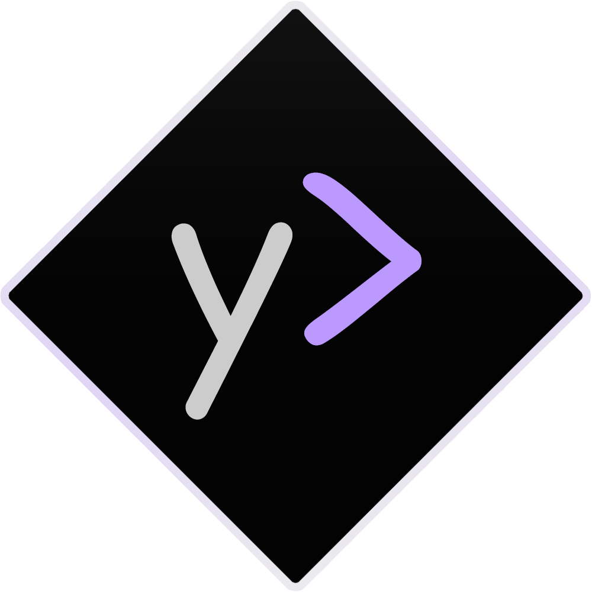

# yume

  
  <h3>claude code, evolved</h3>
  
Professional native desktop interface for Claude Code with zero compromise

  

    <a href="https://aofp.github.io/yume">Download</a>
  

---

## why yume?

Claude Code is transformative for development. Terminal interfaces hold it back.

### terminal limitations

- **flickering** - 700+ upvoted github issue, fundamentally unfixed
- **performance degradation** - multi-second delays in extended sessions
- **terminal crashes** - IDE instability after 10-20 minutes of heavy use
- **hidden rate limits** - requires manual `/usage` checks
- **fragile sessions** - complete loss on crash, no recovery mechanism

### yume's approach

- ✅ **native rendering** - hardware-accelerated UI, zero terminal artifacts
- ✅ **consistent <50ms latency** - responsive input across unlimited session length
- ✅ **standalone architecture** - immune to IDE/terminal crashes
- ✅ **persistent rate limit display** - 5-hour and 7-day metrics always visible
- ✅ **automatic session recovery** - 5-minute checkpoint intervals with 24-hour retention

---

## features

### core foundation
- **persistent rate limit visibility** - 5-hour and 7-day Claude metrics continuously displayed without manual polling
- **zero visual artifacts** - native rendering eliminates the terminal flickering issue affecting 700+ users
- **keyboard-centric workflow** - 30+ shortcuts covering all operations, full mouse-free navigation
- **guaranteed low latency** - maintains sub-50ms response time regardless of session duration
- **standalone reliability** - independent process isolation prevents IDE/terminal crash propagation
- **intelligent auto-compaction** - threshold-based context management (60% warning, 65% automatic) with visual feedback

### agent & extension system
- **5 specialized agents** - architect (planning), explorer (read-only analysis), implementer (focused edits), guardian (security review), specialist (domain-specific tasks)
- **extensible plugin architecture** - first-class support for custom commands, agents, hooks, skills, and MCP servers
- **context-aware skills** - automatic context injection triggered by file extensions, keyword patterns, or regex matches
- **parallel agent execution** - 4 concurrent background agents with git branch isolation for conflict-free workflows
- **persistent memory system** - knowledge graph maintains learned patterns, preferences, and project context across sessions
- **native voice input** - integrated speech-to-text for hands-free coding and long-form explanations
- **temporal checkpoints** - visual timeline navigation for code state with rewind, restore, and comparison capabilities
- **comprehensive analytics** - detailed breakdown of usage by project, model, date, with token accounting and cost tracking
- **crash-resilient sessions** - 5-minute automatic checkpoints with 24-hour recovery window
- **enhanced @ mention system** - @r (recent files), @m (modified files), intelligent folder navigation
- **multi-provider support** - claude, gemini, openai via unified yume-cli interface

### customization & compatibility
- **570+ visual themes** - 31 base themes × (189 accents + 189 backgrounds + 189 foregrounds)
- **OLED optimization** - pure black (#000000) default theme for power efficiency and contrast
- **100% CLI compatibility** - full support for subagents, MCP, hooks, skills, claude.md, @mentions, /commands

---

## tech stack

- **tauri 2.9** - rust backend, native speed
- **react 19** - modern ui with virtualized rendering
- **<50ms response time** - type and the ui responds instantly
- **10k+ messages** - scroll through hours without lag
- **zero telemetry** - your code stays on your machine

---

## comparison

| feature | cli | cursor | opcode | crystal | yume |
|---------|-----|--------|--------|---------|------|
| limits always visible | /usage | ✗ | ✗ | ✗ | ✓ always |
| plugin/skills system | ✗ | ✗ | ✗ | ✗ | ✓ unique |
| 5 built-in agents | ✗ | ✗ | ✗ | ✗ | ✓ |
| crash recovery | ✗ | ✗ | ✗ | ✗ | ✓ |
| @ mentions | partial | ✗ | ✗ | ✗ | ✓ @r @m |
| stream timers | ✗ | ✗ | ✗ | ✗ | ✓ live |
| native app | terminal | electron | tauri | electron | ✓ tauri |
| customization | ✗ | ~5 themes | ✗ | ✗ | ✓ 570+ |
| price | pro/max | $20-200/mo | ✓ free | ✓ free | ✓ free |

---

## download

visit [aofp.github.io/yume](https://aofp.github.io/yume) for all download options.

---

## keyboard shortcuts

| action | macOS | Windows/Linux |
|--------|-------|---------------|
| new tab | ⌘T | Ctrl+T |
| close tab | ⌘W | Ctrl+W |
| toggle model | ⌘⇧O | Ctrl+Shift+O |
| model & tools | ⌘O | Ctrl+O |
| settings | ⌘, | Ctrl+, |
| search messages | ⌘F | Ctrl+F |
| files panel | ⌘E | Ctrl+E |
| git panel | ⌘G | Ctrl+G |
| agents | ⌘N | Ctrl+N |
| clear context | ⌘L | Ctrl+L |
| compact context | ⌘M | Ctrl+M |
| command palette | ⌘P | Ctrl+P |
| recent projects | ⌘R | Ctrl+R |

30+ shortcuts total. every action accessible via keyboard on all platforms.

---

## 5 built-in agents

yume includes 5 specialized agents that follow your selected model (opus/sonnet):

- **architect** - plans and decomposes. runs before complex tasks.
- **explorer** - read-only search. understands without editing.
- **implementer** - focused edits. minimal diffs.
- **guardian** - reviews for bugs and security issues.
- **specialist** - tests, docs, devops, data.

---

## requirements

- **claude subscription** - pro or max required for claude code access
- **macos** 11+ (big sur or later)
- **windows** 10+ (64-bit)
- **linux** ubuntu 20.04+ or equivalent

---

## license

yume is free to download and use with 2 tab limit. upgrade to pro for unlimited tabs ($21 one-time payment).

---

## links

- **download**: [aofp.github.io/yume](https://aofp.github.io/yume)
- **docs**: [aofp.github.io/yume/docs/release/viewer.html](https://aofp.github.io/yume/docs/release/viewer.html)
- **issues**: [github.com/aofp/yume/issues](https://github.com/aofp/yume/issues)
- **claude code cli**: [github.com/anthropics/claude-code](https://github.com/anthropics/claude-code)

---

  
made with claude code + yume

