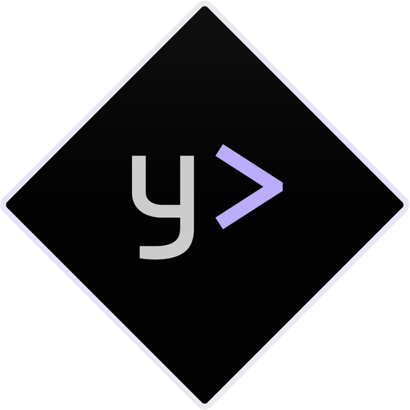

# yume

<div align="center">
  
  <h3>claude code, unchained</h3>
  <p>orchestration flow. memory system. background agents.<br>4 built-in agents. plugins & skills.</p>
  <p>
    <a href="https://aofp.github.io/yume">Download</a>
  </p>
</div>

---

## why yume?

Claude Code is transformative for development. Terminal interfaces hold it back.

### terminal limitations

- **flickering** - 700+ upvoted github issue, fundamentally unfixed
- **performance degradation** - multi-second delays in extended sessions
- **terminal crashes** - IDE instability after 10-20 minutes of heavy use
- **hidden rate limits** - requires manual `/usage` checks
- **fragile sessions** - complete loss on crash, no recovery mechanism

### yume's approach

- ✅ **native rendering** - hardware-accelerated UI, zero terminal artifacts
- ✅ **consistent <50ms latency** - responsive input across unlimited session length
- ✅ **standalone architecture** - immune to IDE/terminal crashes
- ✅ **persistent rate limit display** - 5-hour and 7-day metrics always visible
- ✅ **automatic session recovery** - 5-minute checkpoint intervals with 24-hour retention

---

## how it works

yume is **not** an alternate harness or api wrapper. we spawn the **official claude code cli** as a subprocess.

```
yume app → spawns real cli binary → cli handles auth → anthropic servers
```

this is fundamentally different from tools that spoof headers to bypass api pricing. yume:
- runs the actual `claude` binary installed on your machine
- uses your existing claude pro/max subscription
- never touches anthropic's api directly
- maintains 100% cli compatibility (subagents, mcp, hooks, skills, claude.md all work)

think of it like **iterm vs terminal.app** - a different frontend for the same tool.

---

## features

### orchestration flow (unique to yume)
- **automatic task decomposition** - understand → decompose → act → verify workflow
- **complex task handling** - 3+ step tasks get architect planning, implementer execution, guardian verification
- **trivial task passthrough** - simple tasks proceed directly without overhead
- **no commands needed** - baked into every session via --append-system-prompt

### agent system
- **4 built-in agents** - synced to ~/.claude/agents/yume-*.md
  - **architect** - plans, decomposes tasks, identifies risks, todowrite tracking
  - **explorer** - read-only codebase search, glob/grep/read, never modifies
  - **implementer** - focused code changes, edit/write, minimal diffs
  - **guardian** - reviews for bugs, security, performance after changes
- **4 concurrent background agents** - async execution with git branch isolation (yume-async-{type}-{id})
- **no timeout** - agents run until completion, output to ~/.yume/agent-output/
- **streaming isolation** - background agents don't interfere with main session
- **merge conflict detection** - pre-merge checks before integrating agent work

### memory v2 system
- **per-project markdown** - organized files in ~/.yume/memory/ (global + project-specific)
- **5 importance levels** - ephemeral (1d), low (7d), normal (30d), high (90d), permanent
- **auto-learning** - extracts patterns from error/fix conversations, architecture decisions
- **ttl-based expiration** - automatic pruning of outdated entries
- **mcp integration** - custom yume-mcp-memory.cjs server for claude access

### multi-provider support
- **6 models, 3 providers** - via yume-cli shim
  - claude sonnet 4.5, opus 4.5
  - gemini 2.5 pro, flash
  - gpt-5.2 codex, codex mini
- **protocol normalization** - stream-json output for all providers
- **same interface** - switch providers without changing workflow

### core features
- **persistent rate limit visibility** - 5h and 7d limits always visible, no /usage needed
- **zero visual artifacts** - native rendering eliminates terminal flickering
- **live thinking stream** - watch claude reason word-by-word, not after the fact
- **keyboard-first** - 32+ shortcuts, full mouse-free navigation
- **<50ms response time** - instant UI regardless of session length
- **standalone reliability** - independent process, immune to IDE crashes
- **auto-compaction** - variable threshold (default 75%), user configurable or disable

### plugin & skills system
- **complete extensibility** - commands, agents, hooks, skills, MCP servers
- **skills auto-injection** - context based on file extensions, keywords, regex
- **plugin directory** - install/enable/disable per component
- **bundled yume plugin** - default commands and agents

### additional features
- **crash recovery** - 30s auto-save, 5-min snapshots, 24hr retention, complete session restore
- **history rollback** - restore points per message, conflict detection, undo edits
- **mid-stream context** - real-time token updates during streaming
- **analytics dashboard** - usage by project/model/date, cost tracking, export
- **voice dictation** - F5 to toggle, native speech-to-text
- **@ mention system** - @ shows recent/modified files with autocomplete, folder navigation

### customization
- **12 themes, infinite combinations** - accents, backgrounds, foregrounds fully customizable
- **OLED optimization** - pure black (#000000) default
- **100% CLI compatibility** - subagents, MCP, hooks, skills, claude.md, /commands

---

## tech stack

- **tauri 2.9** - rust backend, native speed
- **react 19** - modern ui with virtualized rendering
- **sqlite + wal** - sessions, messages, analytics persistence
- **socket.io** - real-time streaming with mid-stream context updates
- **compiled binaries** - no node.js dependency for end users (@yao-pkg/pkg)
- **3-process architecture** - tauri (rust) + react ui + node.js server
- **zero telemetry** - your code stays on your machine

---

## comparison

| feature | cli | cursor | opcode | crystal | yume |
|---------|-----|--------|--------|---------|------|
| orchestration flow | ✗ | ✗ | ✗ | ✗ | ✓ auto |
| memory system | ✗ | ✗ | ✗ | ✗ | ✓ v2 md |
| background agents | ✗ | ✗ | ✗ | ✗ | ✓ 4 async |
| multi-provider | ✗ | ✗ | ✗ | ✗ | ✓ 6 models |
| live thinking stream | ✗ after | ✗ | ✗ | ✗ | ✓ word-by-word |
| limits always visible | /usage | ✗ | ✗ | ✗ | ✓ always |
| plugin/skills system | ✗ | ✗ | ✗ | ✗ | ✓ unique |
| 4 built-in agents | ✗ | ✗ | ✗ | ✗ | ✓ |
| crash recovery | ✗ | ✗ | ✗ | ✗ | ✓ 24hr |
| @ mentions | partial | ✗ | ✗ | ✗ | ✓ |
| stream timers | ✗ | ✗ | ✗ | ✗ | ✓ live |
| native app | terminal | electron | tauri | electron | ✓ tauri |
| customization | ✗ | ~5 themes | ✗ | ✗ | ✓ ∞ |
| price | pro/max | $20-200/mo | ✓ free | ✓ free | ✓ free |

---

## download

visit [aofp.github.io/yume](https://aofp.github.io/yume) for all download options.

---

## keyboard shortcuts

| action | macOS | Windows/Linux |
|--------|-------|---------------|
| new tab | ⌘T | Ctrl+T |
| close tab | ⌘W | Ctrl+W |
| toggle model | ⌘⇧O | Ctrl+Shift+O |
| model & tools | ⌘O | Ctrl+O |
| settings | ⌘, | Ctrl+, |
| search messages | ⌘F | Ctrl+F |
| files panel | ⌘E | Ctrl+E |
| git panel | ⌘G | Ctrl+G |
| agents | ⌘N | Ctrl+N |
| clear context | ⌘L | Ctrl+L |
| compact context | ⌘M | Ctrl+M |
| command palette | ⌘P | Ctrl+P |
| recent projects | ⌘R | Ctrl+R |

30+ shortcuts total. every action accessible via keyboard on all platforms.

---

## agents

yume includes 4 built-in agents synced to ~/.claude/agents/yume-*.md + 4 concurrent background agents:

**foreground agents** (follows selected model):
- **architect** - plans, decomposes, todowrite. runs before complex tasks.
- **explorer** - read-only glob/grep/read. understands codebase.
- **implementer** - edit/write. focused changes, minimal diffs.
- **guardian** - reviews for bugs, security, performance.

**background agents** (4 concurrent, async):
- git branch isolation: yume-async-{type}-{id}
- no timeout (runs until completion)
- output to ~/.yume/agent-output/
- streaming isolation from main session
- merge conflict detection

---

## requirements

- **claude subscription** - pro or max required for claude code access
- **macos** 11+ (big sur or later)
- **windows** 10+ (64-bit)
- **linux** ubuntu 20.04+ or equivalent

---

## license

yume is free to download and use (trial: 3 tabs, 1 window). upgrade to pro for 99 tabs and 99 windows ($29 one-time payment).

---

## links

- **download**: [aofp.github.io/yume](https://aofp.github.io/yume)
- **docs**: [aofp.github.io/yume/docs/](https://aofp.github.io/yume/docs/)
- **issues**: [github.com/aofp/yume/issues](https://github.com/aofp/yume/issues)
- **claude code cli**: [github.com/anthropics/claude-code](https://github.com/anthropics/claude-code)

---

<div align="center">
  <p>made with claude code + yume</p>
</div>
