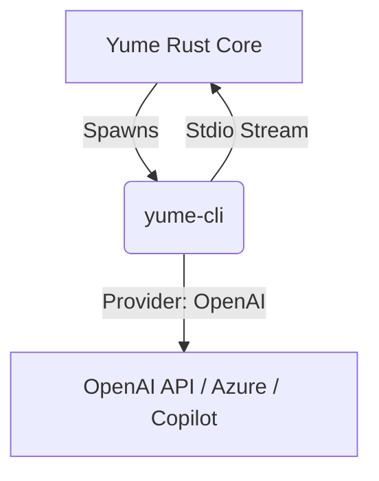

# Codex / OpenAI Integration Specification

## Objective
Enable Yume to drive OpenAI-compatible models (GPT-4o, O1, GitHub Copilot) via a standardized CLI interface, treating them as first-class agents within the Yume GUI.

## Architecture: The Universal Shim (`yume-cli`)

We will use the same **`yume-cli`** shim used for Gemini, adding an OpenAI provider strategy. This avoids code duplication in the Rust core.

### 1. Rust Implementation (`src-tauri/src/codex_spawner.rs`)

We will implement a `CodexSpawner` (or `OpenAISpawner`) struct.

*   **Responsibility:**
    *   Spawn `yume-cli` with `--provider openai`.
    *   Pass `OPENAI_API_KEY` or `GITHUB_TOKEN` via environment variables.

### 2. The Shim Layer (`yume-cli`)

*   **Provider Strategy:** `OpenAIProvider`
*   **Authentication:**
    *   **OpenAI:** `OPENAI_API_KEY` env var.
    *   **GitHub Copilot:** `gh auth token` (if using Copilot as the backend).
*   **API Client:** Standard `openai` Node.js library.

### 3. Protocol Normalization

Mapping OpenAI's Chat Completion chunk stream to Yume's JSON-L protocol.

| Event | OpenAI Equivalent | Shim Action |
|-------|-------------------|-------------|
| `text` | `delta.content` | Emit `{"type": "assistant", "message": { "content": "..." }}` |
| `tool_use` | `delta.tool_calls` | Buffer chunks until valid JSON arguments are formed, then emit `tool_use`. **Critical:** OpenAI streams arguments as partial strings; Yume expects a full `tool_use` event. The shim must buffer. |
| `tool_result` | `tool` role message | Send tool output back to API as a tool message. |

## Feature Specifications

### Tooling (Function Calling)
OpenAI's function calling is robust. We will map Yume's standard tools (`Edit`, `Bash`, `Glob`) to OpenAI function definitions.

### O1 Reasoning Models
For `o1-preview` or `o1-mini`:
*   **Thinking:** These models output reasoning tokens.
*   **Protocol:** Map reasoning output to Yume's "Ultrathink" UI blocks if possible, or just standard text with a special delimiter.

### GitHub Copilot Integration
To support "Codex" via GitHub Copilot:
1.  **Auth:** Check `gh auth status`.
2.  **Token:** Retrieve token via `gh auth token`.
3.  **Endpoint:** Use Copilot-specific API endpoints (often `https://api.githubcopilot.com/chat/completions`).
4.  **Headers:** Inject necessary Copilot headers.

## Implementation Plan

1.  **Shim:** Add `OpenAIProvider` to `yume-cli` with argument buffering logic.
2.  **Backend:** Create `src-tauri/src/openai_spawner.rs`.
3.  **Frontend:** Add "GPT-4o" and "O1" to the Model Selector.
4.  **Verification:** Test `Edit` tool reliability, as OpenAI models may format file paths differently.