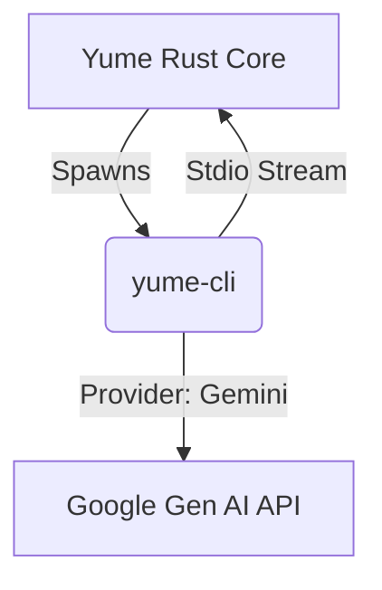

# Gemini CLI Integration Specification

## Objective
Enable Yume to drive Google's Gemini models (Gemini 1.5 Pro/Flash) via a standardized CLI interface, achieving feature parity with the existing Claude integration.

## Architecture: The Universal Shim (`yume-cli`)

Instead of building a custom adapter for every model provider inside the Rust core, we utilize **`yume-cli`**, a Node.js executable that standardizes the input/output protocol.



### 1. Rust Implementation (`src-tauri/src/gemini_spawner.rs`)

We will implement a `GeminiSpawner` struct analogous to `ClaudeSpawner`.

*   **Responsibility:**
    *   Detect if `yume-cli` is installed/available (bundled resource).
    *   Spawn `yume-cli` with `--provider gemini`.
    *   Manage the child process lifecycle.
    *   Stream `stdout` (JSON-L) to the frontend via the existing event loop.

```rust
pub struct GeminiSpawner {
    // Path to yume-cli executable (node or binary)
    cli_path: PathBuf, 
    working_directory: PathBuf,
    // Google Cloud Project / API Key info
    environment: HashMap<String, String>,
}

impl GeminiSpawner {
    pub fn spawn(&self) -> Command {
        let mut cmd = Command::new("node");
        cmd.arg(&self.cli_path)
           .arg("start")
           .arg("--provider").arg("gemini")
           .arg("--model").arg("gemini-1.5-pro");
        // ...
        cmd
    }
}
```

### 2. The Shim Layer (`yume-cli`)

*   **Location:** `packages/yume-cli/` (or embedded in `server-*.cjs` for now).
*   **Gemini Provider Strategy:**
    *   **Auth:** Uses `gcloud auth print-access-token` to get a Bearer token. This assumes the user has the Google Cloud SDK installed and authenticated (`gcloud auth login`).
    *   **Fallback Auth:** Checks `GOOGLE_API_KEY` environment variable.
    *   **API Client:** Uses `@google/generative-ai` or direct REST calls.

### 3. Protocol Normalization

The `yume-cli` must emit the exact JSON-L events Yume expects (the "Claude Code Protocol"):

| Event | Gemini Equivalent | Shim Action |
|-------|-------------------|-------------|
| `text` | `GenerateContentResponse.text()` | Emit `{"type": "assistant", "message": { "content": "..." }}` |
| `tool_use` | `FunctionCall` | Emit `{"type": "tool_use", "message": { "name": "...", "input": ... }}` |
| `tool_result` | `FunctionResponse` | Read result, send to API, stream back to Yume. |

## Feature Specifications

### Authentication
Yume will **NOT** implement a custom Google Login flow.
1.  **Check 1:** Is `gcloud` installed?
2.  **Check 2:** Run `gcloud auth print-access-token`.
3.  **Result:** If successful, start session. If fail, show error: "Please run `gcloud auth login` or set `GOOGLE_API_KEY`."

### Context Window
Gemini 1.5 Pro supports 1M+ tokens.
*   **Compaction:** Disable the aggressive auto-compaction used for Claude (200k limit).
*   **Config:** Add `contextWindowSize` to the Session configuration, defaulting to 1M for Gemini.

### Tooling
Gemini supports Function Calling. `yume-cli` will declare the standard Yume toolset (`Edit`, `grep`, `ls`, etc.) as function declarations in the Gemini API call.

## Implementation Plan

1.  **Core:** Build `yume-cli` (Node.js) with `GeminiProvider`.
2.  **Backend:** Create `src-tauri/src/gemini_spawner.rs` to spawn the CLI.
3.  **Frontend:** Add "Gemini" to the Model Selector dropdown.
4.  **Verify:** Test `Edit` tool performance with Gemini 1.5 Pro.