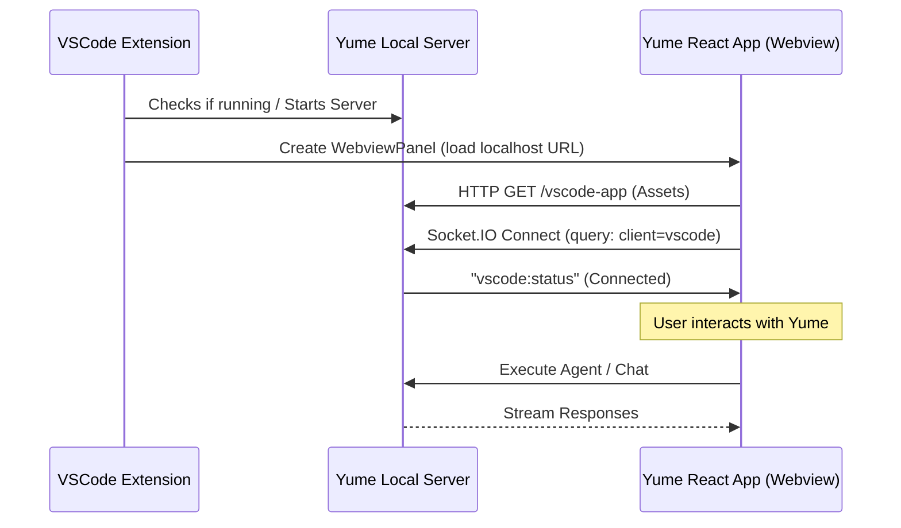

# VSCode Integration Architecture

## Overview
Yume integrates with VSCode not just as an external tool, but by embedding its full GUI directly within VSCode's interface. This allows developers to use Yume's advanced features (agents, timeline, diff view) without leaving their editor.

## Architecture

### 1. The "Headless" Server
Yume's core logic runs in a local Node.js server (`server-claude-*.cjs`). This server is capable of serving the frontend application via HTTP.

*   **Endpoints:**
    *   `/vscode-app`: Serves the built React frontend optimized for VSCode.
    *   `/vscode-status`: Returns connection status (`{ connected: boolean, count: number }`).
    *   `/vscode-ui`: Entry point that redirects to `/vscode-app` with necessary query params.

### 2. The VSCode Extension (`yume-vscode`)
A lightweight VSCode extension (VSIX) acts as the container.
*   **Location:** `src-tauri/resources/yume-vscode` (source) / `resources/yume-vscode.vsix` (packaged).
*   **Function:**
    1.  Starts or locates the Yume server process.
    2.  Creates a **WebviewPanel** in VSCode.
    3.  Loads `http://localhost:<port>/vscode-ui?vscode=1&cwd=<workspace>` into the webview.
    4.  Establishes a communication bridge (if necessary) for specific IDE commands.

### 3. Frontend Adaptations (`src/renderer/`)
The React application detects it is running inside VSCode via URL parameters (`?vscode=1`).

*   **Detection:** `src/renderer/services/tauriApi.ts` -> `isVSCode()`.
*   **UI Changes:**
    *   **Window Controls:** Hides native window controls (traffic lights, title bar) as VSCode handles the window.
    *   **Context Bar:** Adapts buttons (hides Files/Git buttons if they overlap with VSCode native functionality, creates specific "Open in Editor" actions).
    *   **Theme:** Syncs with VSCode's current theme (Dark/Light/High Contrast).
    *   **Status Indicator:** Displays a "VSCode Connected" badge.

## Communication Flow

## Features

*   **Unified Context:** Yume automatically picks up the `cwd` (Current Working Directory) from the VSCode workspace.
*   **Theme Sync:** Yume's UI blends seamlessly with VSCode's colors.
*   **Focus Management:** Intelligent focus handling between the editor and the Yume webview.
*   **Extension Management:**
    *   Auto-install logic in `src-tauri/src/commands/plugins.rs`.
    *   Settings toggle to Install/Uninstall the extension directly from Yume.

## Future Improvements
*   **Direct File Opening:** Allow Yume to click a file reference and open it in the VSCode editor tab (via `vscode-link` protocol or socket message).
*   **Diagnostics Sync:** Stream VSCode diagnostics (errors/warnings) into Yume context automatically.
