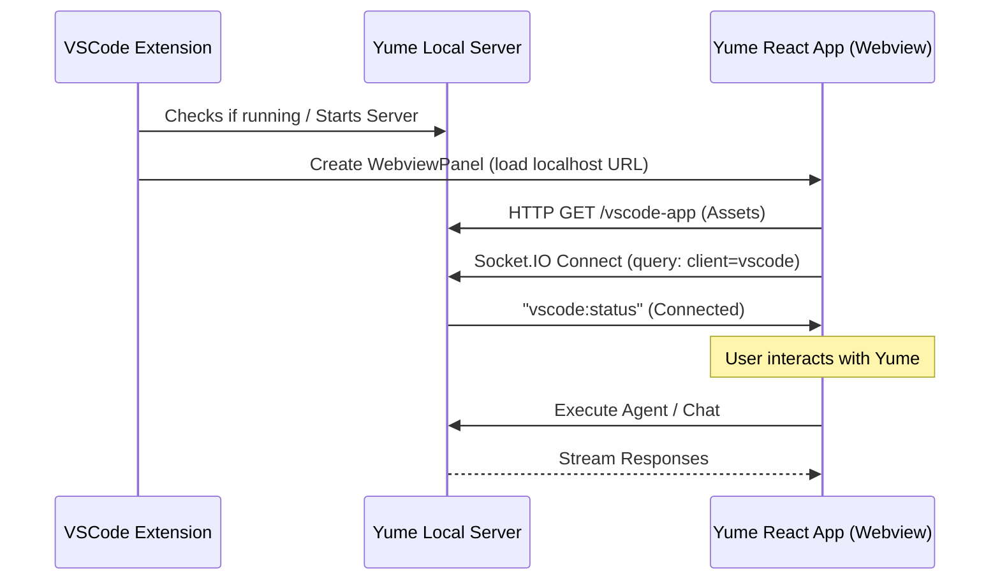

# VSCode Integration Architecture

*Last Updated: January 31, 2026*

*Status: Planned - Not yet implemented*

## Overview
Yume embeds its full GUI within VSCode via a webview panel. Developers use Yume's features (agents, timeline, diff view) without leaving the editor.

## Architecture

### 1. Node.js Server
The local server (`server-claude-*.cjs`) serves the frontend via HTTP:
- `/vscode-app` - React frontend optimized for VSCode
- `/vscode-status` - Connection status `{ connected, count }`
- `/vscode-ui` - Entry point redirecting to `/vscode-app` with query params

### 2. VSCode Extension (`yume-vscode`)
Lightweight extension acting as container:
- **Source:** `src-tauri/resources/yume-vscode`
- **Packaged:** `resources/yume-vscode.vsix`
- **Function:** Starts/locates Yume server, creates WebviewPanel, loads `http://localhost:<port>/vscode-ui?vscode=1&cwd=<workspace>`

### 3. Frontend Adaptations
React app detects VSCode mode via `?vscode=1` URL parameter:
- **Detection:** `tauriApi.ts` - `isVSCode()`
- **Window Controls:** Hidden (VSCode handles window)
- **Context Bar:** Adapts buttons, adds "Open in Editor" actions
- **Theme:** Syncs with VSCode theme (Dark/Light/High Contrast)
- **Status:** "VSCode Connected" badge

## Communication Flow

```mermaid
sequenceDiagram
    participant VSCode as VSCode Extension
    participant Server as Yume Local Server
    participant Webview as Yume React App (Webview)

    VSCode->>Server: Checks if running / Starts Server
    VSCode->>Webview: Create WebviewPanel (load localhost URL)
    Webview->>Server: HTTP GET /vscode-app (Assets)
    Webview->>Server: Socket.IO Connect (query: client=vscode)
    Server->>Webview: "vscode:status" (Connected)
    
    Note over Webview: User interacts with Yume
    
    Webview->>Server: Execute Agent / Chat
    Server-->>Webview: Stream Responses
```

## Features

- **Unified Context:** Auto-picks `cwd` from VSCode workspace
- **Theme Sync:** Blends with VSCode colors
- **Focus Management:** Intelligent focus between editor and webview
- **Extension Management:** Auto-install via `plugins.rs`, settings toggle to install/uninstall

## Future Work

- **Direct File Opening:** Click file reference to open in VSCode editor tab
- **Diagnostics Sync:** Stream VSCode errors/warnings into Yume context
